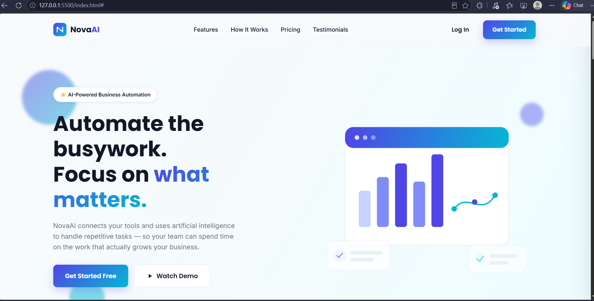
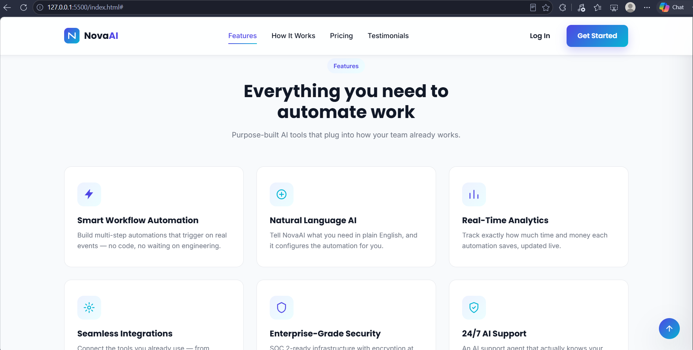
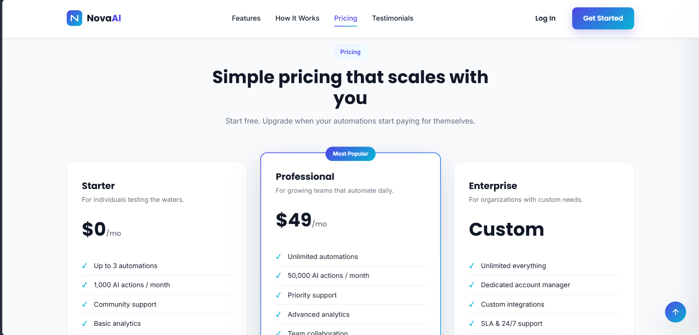
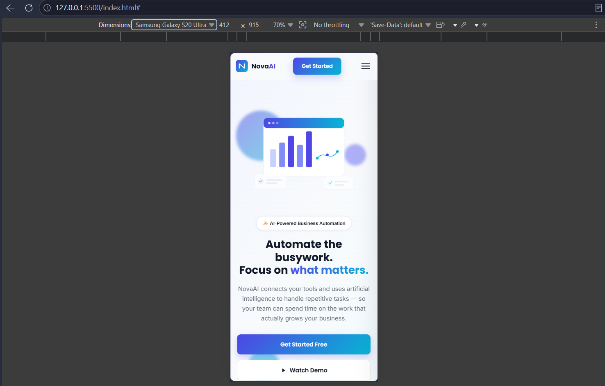

# NovaAI — Animated Landing Page


A modern, fully responsive landing page for **NovaAI**, a fictional AI startup that helps businesses automate repetitive work. Built with plain HTML5, CSS3, and vanilla JavaScript — no frameworks, no build step.

## Live Demo

🌐 https://ira612.github.io/animated-landing-page/

## Project Overview

NovaAI is a fictional AI startup created for this project. The goal was to design and develop a modern marketing landing page that resembles a professional SaaS product, featuring a compelling hero section, social proof, feature highlights, pricing plans, and a conversion-focused call to action.

Since the internship brief focused solely on the landing page, all visual assets — including the logo, hero illustration, icons, and avatars — were created using inline SVG. This keeps the project self-contained, lightweight, and free from external image dependencies.

## Table of Contents

- [Live Demo](#live-demo)
- [Project Overview](#project-overview)
- [Table of Contents](#table-of-contents)
- [Screenshots](#screenshots)
- [Features](#features)
- [Technologies Used](#technologies-used)
- [Skills Demonstrated](#skills-demonstrated)
- [CSS Animations](#css-animations)
- [JavaScript Functionality](#javascript-functionality)
- [Responsive Design](#responsive-design)
- [Accessibility](#accessibility)
- [Browser Support](#browser-support)
- [Folder Structure](#folder-structure)
- [Installation & Usage](#installation--usage)
- [Reflection](#reflection)
- [Future Improvements](#future-improvements)
- [Author](#author)
## Screenshots

### Hero Section



### Features



### Pricing



### Mobile View



## Features

- Sticky, blur-backed navbar that gains a shadow on scroll
- Hero section with a floating illustration, animated gradient background, and floating decorative shapes
- "Trusted by" row of company cards with hover lift
- 6-card feature grid that reveals on scroll
- Animated statistics counters (1000+, 250+, 99%, 24/7)
- 3-step "How It Works" section
- 3 testimonial cards with star ratings and avatars
- 3-tier pricing table with a highlighted, gradient-bordered "Professional" plan
- Full-width gradient CTA band with floating animated circles
- Footer with quick links, social icons, and an email
- Back-to-top button that appears after scrolling and scrolls smoothly
- Mobile hamburger menu with a slide-in panel
- Fully responsive from 1200px down to small mobile screens

## Technologies Used

- **HTML5** — semantic markup (`header`, `nav`, `main`, `section`, `footer`)
- **CSS3** — custom properties (CSS variables) for the color system, Flexbox and CSS Grid for layout, `backdrop-filter` for the glassy navbar
- **Vanilla JavaScript (ES6)** — no libraries, no frameworks
- **Google Fonts** — Poppins (headings) and Inter (body copy)

## Skills Demonstrated

- Semantic HTML5
- CSS Grid
- Flexbox
- CSS Variables
- CSS Animations
- Responsive Design
- Intersection Observer API
- requestAnimationFrame
- DOM Manipulation
- Accessibility
- Performance Optimization

## CSS Animations

Defined in `css/animations.css`:

| Animation | Where it's used |
|---|---|
| `fadeIn` | Hero content on page load |
| `slideUp` | Scroll-revealed sections, triggered when `.reveal` elements gain `.is-visible` |
| `float` | Hero illustration and decorative background shapes |
| `pulse` | Floating stat chips inside the hero illustration |
| `gradientShift` | Animated hero background gradient |
| `bounce` | Smaller decorative shapes in the hero and CTA section |

All hover interactions (buttons, cards, nav links, social icons, logo, images) use `transition: all 0.3s ease` as required, defined once via the `--transition` CSS variable and reused everywhere for consistency.

Motion is used where it reinforces the product story (a live dashboard, floating UI chips, a moving gradient to suggest "AI activity") rather than added indiscriminately. `prefers-reduced-motion` is respected globally — animations and smooth scroll are disabled for users who've asked their OS for reduced motion.

## JavaScript Functionality

All in `js/script.js`, vanilla JS only:

- **Intersection Observer** — drives scroll-reveal on feature cards, stats, the steps section, testimonials, pricing cards, and the CTA band. Each element is unobserved after animating once (`revealObserver.unobserve(...)`), so nothing re-triggers on scroll-up.
- **Animated counters** — the stats section (`1000+`, `250+`, `99%`) counts up from 0 using `requestAnimationFrame` with an eased progress curve, triggered the first time the section enters the viewport.
- **Smooth scroll** — every in-page `href="#..."` link scrolls smoothly to its target, offset by the sticky navbar's height so section headings aren't hidden underneath it.
- **Active navbar link** — a second Intersection Observer watches each `<section id="...">` and highlights the matching nav link as the user scrolls through the page.
- **Back-to-top button** — hidden until the user scrolls 500px down, then fades/slides in; smooth-scrolls to the top on click.
- **Mobile hamburger menu** — toggles a slide-in panel and closes automatically when a link inside it is tapped.
- **Performance** — scroll-based work (navbar state, back-to-top visibility) is batched behind a single `requestAnimationFrame`-throttled scroll listener instead of running unthrottled on every scroll event. Animated elements use `transform`/`opacity` (not `top`/`left`) and `will-change` where it helps the browser skip unnecessary layout work.

## Responsive Design

Breakpoints (in `css/responsive.css`):

- **1200px** — tighter grid gaps; feature/testimonial/pricing grids drop from 3 to 2 columns
- **992px** — nav links collapse into the hamburger menu; hero becomes a single centered column with the illustration on top; stats grid becomes 2×2
- **768px** — feature/testimonial/pricing grids become a single column; footer columns stack and center
- **576px** — mobile type scale, full-width stacked CTA buttons, tighter section padding

## Accessibility

- Semantic HTML5 (`header`, `nav`, `main`, `section`, `footer`)
- A "Skip to main content" link for keyboard users
- ARIA attributes (`aria-label`, `aria-expanded`) on the hamburger menu, social icons, and back-to-top button
- Keyboard-friendly navigation — every interactive element is a real `<a>`/`<button>`
- Visible focus states (`:focus-visible` outline) on links, buttons, and icons
- Respects `prefers-reduced-motion` — animations and smooth scroll are disabled when requested at the OS level

## Browser Support

- Google Chrome ✅
- Microsoft Edge ✅
- Firefox ✅
- Safari ✅

## Folder Structure

```
animated-landing-page/
│
├── index.html
├── css/
│   ├── style.css          # layout, components, color system
│   ├── animations.css     # @keyframes + scroll-reveal helper classes
│   └── responsive.css     # media queries (1200 / 992 / 768 / 576)
│
├── js/
│   └── script.js          # all interactivity, vanilla JS
│
├── assets/
│   ├── images/            # reserved for future raster images
│   ├── icons/             # reserved for future standalone icon files
│   └── logo.png           # reserved — the live logo is inline SVG in index.html
│
├── screenshots/           
│
└── README.md
```

> Note: `assets/` is scaffolded per the required structure, but the project currently ships with **zero external image requests** — every icon, avatar, and the hero illustration is inline SVG, so the page loads fast and never shows a broken image.

## Installation & Usage

No installation or build tools are required. Simply open `index.html` in any modern browser or serve the project locally using a lightweight HTTP server.

1. Download or clone this folder.
2. Open `index.html` directly in any modern browser, **or**
3. Serve it locally for the best experience (recommended, since some browsers restrict `backdrop-filter`/fonts on `file://`):

   ```bash
   # from inside animated-landing-page/
   npx serve .
   # or
   python3 -m http.server 5500
   ```

4. Visit `http://localhost:5500` (or whatever port your server prints).

## Reflection

> I used animations only where they improved the user experience, such as highlighting important sections, providing visual feedback on buttons, and revealing content during scrolling. I avoided excessive motion that could distract users or reduce readability. All animations are smooth, short, and purposeful, making the interface feel modern without affecting usability or performance. The goal was to enhance engagement while keeping navigation simple and comfortable.

## Future Improvements

- Wire the "Get Started" / "Contact Sales" buttons to a real signup and CRM flow
- Add a working newsletter/email capture in the footer
- Replace the placeholder testimonial content with real customer quotes and photos
- Add a dark mode toggle using the existing CSS variable system
- Add a lightweight demo video/modal for the "Watch Demo" button
- Add Open Graph / Twitter Card meta tags for richer link previews
- Introduce a tiny build step (e.g. esbuild) only if the project grows enough to need bundling — intentionally skipped for now to keep the project framework-free and copy-paste runnable

---

## Author

**Duaa Aslam**

BS Computer Science Student

- GitHub: https://github.com/ira612
- LinkedIn: https://www.linkedin.com/in/duaa-rana-b057b72b4

This project was developed as part of the Neurofive Solutions Frontend Web Development Internship (Week 2).
